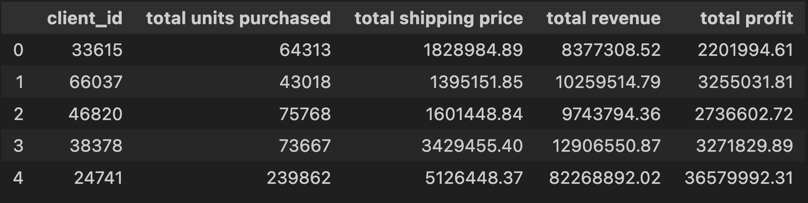
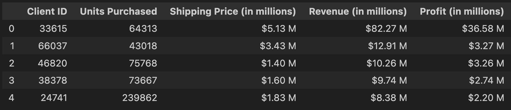

<h1 align="center">E-Commerce Data Analysis</h1>

  

## ✨ Overview

This project is aimed at achieving real-world results by using raw data from an E-commerce type of company to exploit my skills using Pandas (python) to organize, format, explore and clean data. In this project, I had the chance to explore the data, generate findings, perform calculations, analyze the data and provide a summary of the result findings. This file is a detailed description of the process I went through in order to achieve this project. Hope you enjoy!

## 🗺️ Instructions

1. Clone repository [Project Repository](https://github.com/ncmoliver/pandas-challenge-1..git)
2. Open Project Folder (panda-challenge-1)
   - Open wholesale_data_analysis_starter_code.ipynb
   - Select the ▶️ "Run All" and the program will do the work from there 😏

## 🔍 Data Analysis

#### Data Exploration

- My initial interest in the data was understanding the company from an average perspective.
  - How much the average prouct sold for.
  - How much the average product cost.
  - How much the average product weighed.
  - Most sold subcategory + additional metrics

#### Most Entries

- Identified the _category_ and _sub-category_ with the most order entries.
- Identfied the top 5 clients with the most orders (Client ID and # of orders).

## 🧺 Data Cleaning Process

✓ Data cleaning was used to simplify the numbers in the DataFrame.  
✓ Using a lamba function **dollar_to_millions(x)**:

| Parts of the Function | Description/Function                                                                                                                      |
| --------------------- | ----------------------------------------------------------------------------------------------------------------------------------------- |
| **(x)**               | the function requires a dataframe to be passed through.                                                                                   |
| **Returns**           | Scaled Data and Formated Columns: Each value in dataframe is divided by 1 Million to simplify numbers. Column names are renamed to adjust |

## 📷 Data Cleaning Process : Screenshots

### Original DataFrame

### Final DataFrame

## 💼 Project Files

#### 📁 Resources (folder)

- client_dataset.csv : Raw csv file with E-commerce purchase order data.

#### 📁 Screenshots (folder)

- original_sc.png: Used in Readme.md - Original DataFrame
- final_sc.png: Used in Readme.md - Final DataFrame

#### 📄 README.md (file)

- Information file: Find more information about program/analysis, like run instructions, screenshots, and more.

#### 📄 wholesale_data_analysis_starter_code.ipynb (file)

**🌟 Run File**: File where data cleaning, calculations, and analysis happens.

- Requires an editor that can run Pandas packages
- Suggested editors: Jupyter Notebook / VS Code

## Use of Pandas In Project

- Explored DataFrame to understand data better.
- Formatted and renamed columns.
- Performed numerous calcualtions
- Created new dataframes out of existing dataframes
- Concatenated two dataframes together
- Used a lamba function to format and simply numeric dataframe

## References

Online Tutor | **Emmanuel Mpwanga** | Provided helpful assistanced through the duration of the first half of the project.  
[Markdown CheatSheet](https://www.markdownguide.org/cheat-sheet/) - Used for proper Markdown Syntax.  
[How to use Pandas filter with IQR?](https://www.geeksforgeeks.org/how-to-use-pandas-filter-with-iqr/)
[Xpert Learning Assistant](https://bootcampspot.instructure.com/courses/6028/external_tools/313)
